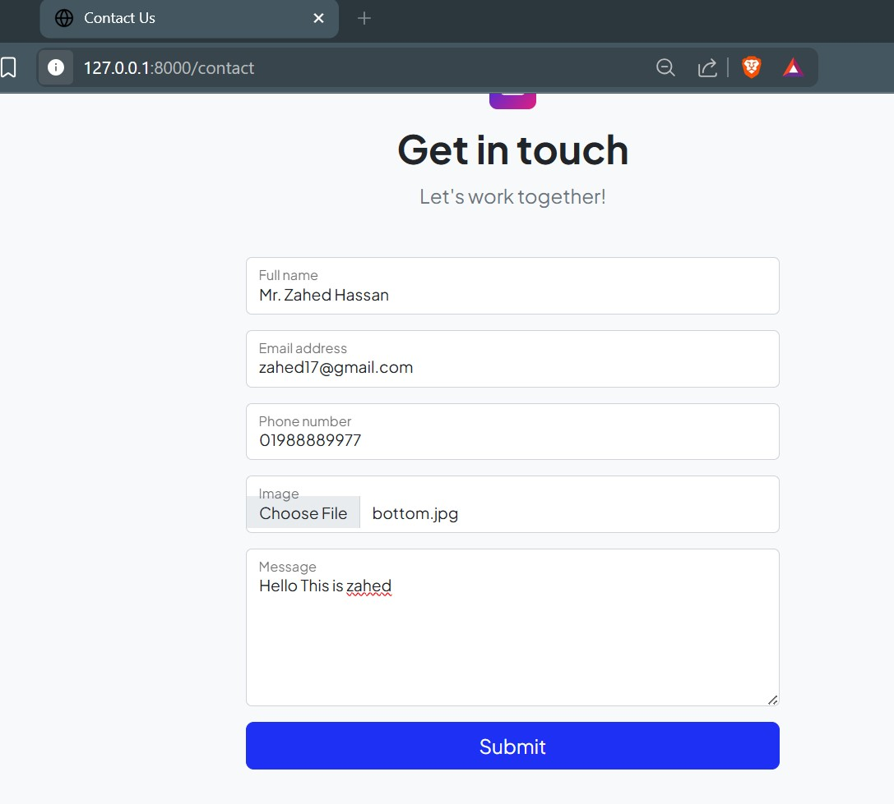

## Module 16: Exam Week 3
### Task-1: Template to Blade Conversion → 25%

Presentation of the project (video) 
[Click here](https://drive.google.com/file/d/1wH01frWOwDTZHf8FJ47fVSARVsi0jyr2/view?usp=sharing)

· You will be provided with an HTML/Bootstrap template. Convert this template into a Laravel Blade layout with proper structure (master layout, header, footer, partials, includes).
· Template link: [Bootstrap Template](https://startbootstrap.com/theme/personal)

### Task-2: Database Design to Migration → 25%

· A database diagram/image will be provided. Create appropriate Laravel migration files to represent the database schema accurately.  

· Diagram link(provided by instructor):[ Database Diagram Google Drive](https://drive.google.com/file/d/14AfuWsc0YyCEYYG3PDdqL3xcH8VqrcTo/view)

Database Schema Design:

### Task-3: Form Submission + Response → 25%

1. Create a form (e.g., contact form or task creation) that will be submitted via POST request.

· After submission:
2. Show a success message using Session.
3. Redirect the user to a confirmation page showing the submitted data.

### Task-4: Bonus Task (Cookie + File Upload) → 15%

1. Implement a file upload feature in the form.
2. Save the uploaded file in the storage directory.
3. On success, set a cookie (e.g., file_uploaded=true) in the response header.